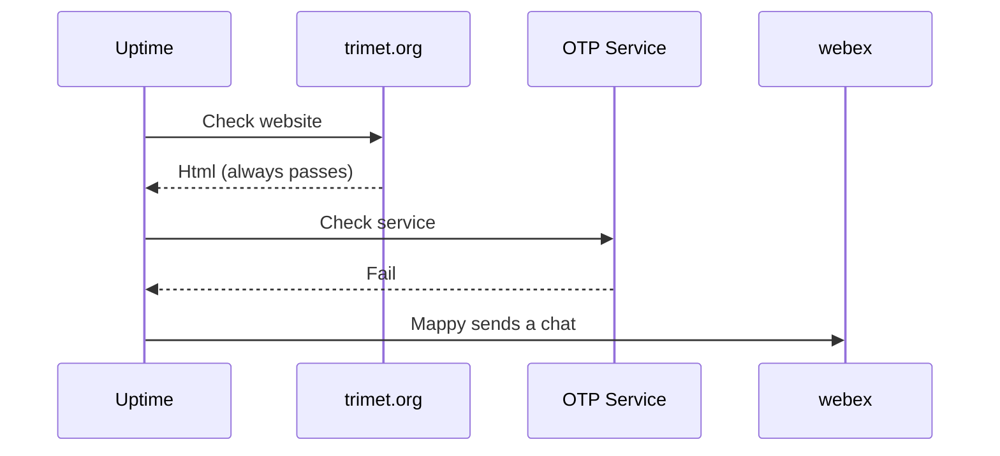
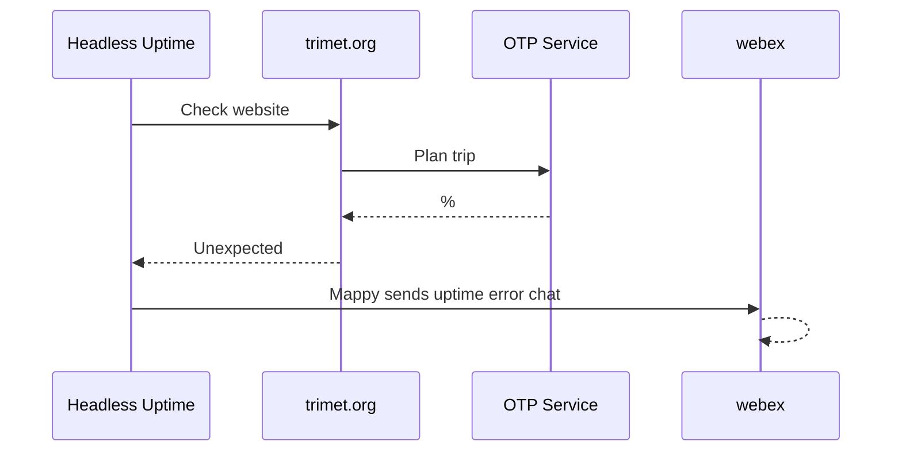

# System Uptime - Parts or the Whole

In monitoring a single page website like `trimet.org`, we can check the parts separately (e.g., the html, the trip service, the arrival service, etc...). For a more complete picture, we can use a headless browser (via [Playwright](https://playwright.dev/python/)) to load trimet.org up, plan a trip or check a stop, and look for elements that would indicate expected state of the app after say a trip was planned.

### Diagram 1 — Check each system part individually for uptime:

Testing each part of the solution individually provides a level of confidence that the system is up.  That said, a much higher level of confidence could be had by exercising the website, and seeing it call the various services and reflect those reults.  Problem is we can't simply run `curl https://labs.trimet.org/home/planner-trip?fromPlace=X&toPlace=Y`, because that call doesn't engage the .javascript code on the page that calls the trip planner.  For such end-to-end system testing, we can employ a 'headless browser' in our uptime tests.

### Diagram 2 — Exercise the complete solution thru a headless browser:

Using Playwright to make trip planner calls to trimet.org, we can look at the state of the app after the trip planner returns with a result. We should see the title of the app change, and see page elements titled "Option 1", "Option 2", etc...  We see those aspects in the app after a trip is planned, and we have high confident that both the underlying parts are working and the app itself is able to use those parts.

